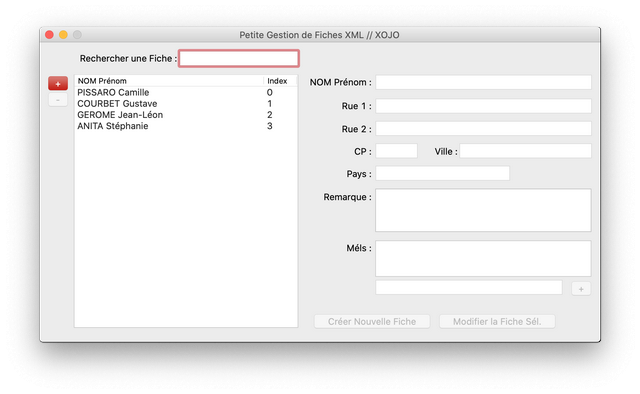

# Xojo-PgfXml
Petite Gestion de Fiche Xml // XOJO

Fonctionnalités :
- Mac Os & Windows
- DOM Xml
- Gestion des Noeuds avec Attributs et Noeuds Simples
- Gestion de Création de Fiches Xml
- Gestion d'ajout, d'édition et de Suppression de Fiches
- Intégration d'un module de recherche de Fiches
- Interface soignée

ToDo List :
Rajout de l'anniversaire
Alerte anniversaire

Si vous aimez mes programmes, <a href="https://www.paypal.com/donate/?hosted_button_id=GY5LTDDPZ2HZG"> vous pouvez faire un don PayPal ;)</a>

Historiques des Versions :

v.019 du 23/01/2020
Ajout du Champ Telephone dans la base de Donnees

v.014 du 27/11/2019
Ajout de la fonction Recherche (2 mehodes disponibles)
Reorganisation du Code
